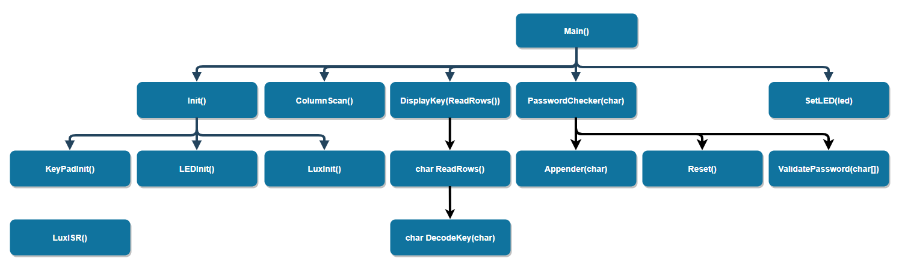

## Det Intelligente Hus

<!-- Indholdsfortegnelse -->

  
Indholdsfortegnelse

  <ol>
    <li>
      <a href="#om-projektet">Om projektet</a>
    </li>
    <li>
      <a href="#setup">Setup</a>
      <ul>
        <li><a href="#krav">Krav</a></li>
        <li><a href="#installation">Installation</a></li>
      </ul>
    </li>
    <li><a href="#praktisk-brug">Praktisk brug</a></li>
    <li><a href="#licens">Licens</a></li>
    <li><a href="#kontakt">Kontakt</a></li>
  </ol>

<!-- Om projektet -->
## Om projektet
Mit intelligente hus er lavet for at kunne sikre mit hjem, samt sørge for automatisk at tænde og slukke for lysene i mit hjem.
Det er skrevet i C og lavet i løbet af mit embedded 2 forløb.

HIPO Diagram

### Security system
  - Dør med kode brug keypad til input .
  - LED til at vise alarmens status, grøn ulåst, gul låst, rød alarm!!.
  - Hvis der bliver indtastet forkert kode 3 gange så trigger alarmen.

### Smart lighting
 - Tænder automatisk lys ved døren hvis der står nogen foran keypad’en.
 - Tænder automatisk lys i hele huset hvis sensoren indikerer der er blevet mørkt.

## Setup

### Krav

1.  ATmega 2560 Microcontroller.
2.  Membrane switch module.
3.  Photoresistor.

### Installation

1.  git clone https://github.com/NielsSchultz/Det-intelligente-hus.git

### RGB LED

De enkelte ben modtager alle 5V gennem en 330Ω modstand, bortset fra det lange ben som er forbundet til jord.

##### Rød:
Port B7 sat til output som ligger på Arduino pin 13 som er forbundet med røde ben af RGB LED'en.  
Output compare register 1C = OC1C.
##### Grøn:
Port B6 sat til output som ligger på Arduino pin 12 som er forbundet med grønne ben af RGB LED'en.  
Output compare register 1B = OC1B.
##### Blå;
Port B5 sat til output som ligger på Arduino pin 11 som er forbundet med blå ben af RGB LED'en.  
Output compare register 1A = OC1A.

Da jeg bruger Waveform Generation Mode 5 som er Fast PWM 8 bit, har jeg værdierne 0-255 til at justere hver enkelt farve.
Det vil sige hvis jeg sætter OC1C til 127 så vil dens duty cycle være på 50% og derfor lyse med 50% af max.

## Praktisk brug
##### Password flowchart

Stil dig foran din keypad, se at lyset foran dig bliver tændt.
Indtast din adgangskode for at komme ind i huset. Læg mærke til hvilken pære der lyser.
Grøn for korrekt, gul for forkert, rød for alarm. (3 forkerte forsøg)

## Licens

None.

## Kontakt

- Email: niels@fakeemail.com
- Telefon: nope
